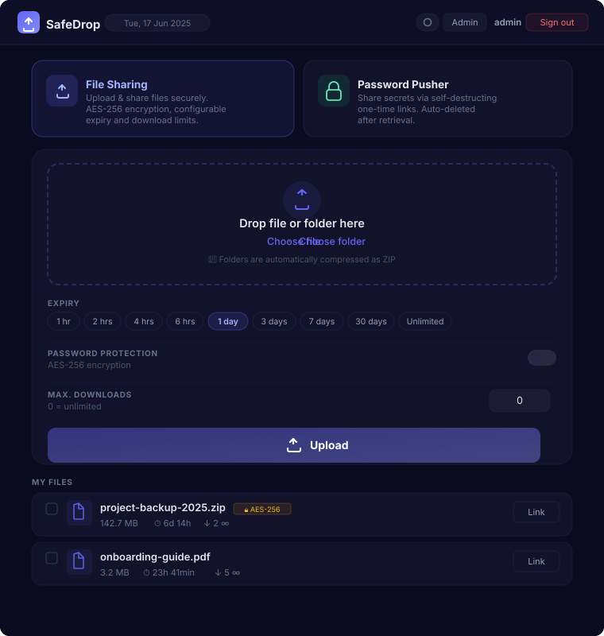

# SafeDrop

**SafeDrop** is a self-hosted file sharing platform with optional AES-256-GCM encryption, user management, and a built-in SafeDrop + Password-Push for one-time secrets. The app runs as a single Docker container with no external dependencies – no cloud, no third-party services.

---

## Screenshot



---

## Features

### File Upload
- **Chunked upload** – large files are transferred in 90 MB blocks; resumable by design
- **Drag & Drop** – drop files or entire folders directly into the browser
- **Folder upload** – folders are automatically compressed as ZIP (JSZip, DEFLATE level 6)
- **Multi-file upload** – upload any number of files in a single session
- **Multi-file ZIP download** – select multiple files via checkbox and download them as a single ZIP archive; encrypted files are decrypted on the fly if the correct password is provided

### Security & Encryption
- **AES-256-GCM** – server-side encryption with authenticated ciphertext; the file is encrypted on the server after assembly
- **PBKDF2 key derivation** – 100,000 iterations, SHA-256, 32-byte key
- **DISA STIG password generator** – 20 characters, guaranteed character classes (upper/lower/digits/special), cryptographically secure
- **GCM auth tag** – integrity verification on decryption

### Expiry & Limits
- **Configurable TTL**: 1 hour · 2 h · 4 h · 6 h · 1 day · 3 days · 7 days · 30 days · No expiry
- **Max downloads** – optional: file is automatically locked after N downloads
- **Cleanup job** – runs hourly, automatically deletes expired files, sessions and secrets
- **Persistent transfer log** – every upload is permanently recorded; deleted and expired files remain visible in the admin transfer log with their final download count and status

### User Roles
| Role | Description |
|------|-------------|
| `admin` | Full access to all files, users, logs and settings |
| `user` | Upload/download own files, SafeDrop + Password-Push |
| `guest` | Anonymous session (4 h), password mandatory, no file list |

### SafeDrop + Password-Push
- One-time secrets with configurable **view limit** (max. 50) and **TTL**
- Optional **passphrase** (PBKDF2-secured)
- Secret is immediately deleted after the last view
- Accessible via the **SafeDrop + Password-Push tab** on the landing page (`/`) or directly at `/push`
- Deep-link to the tab: `/#pusher`

### Image Gallery
- Unencrypted images are displayed as a **gallery view** in the user's file list
- **Lightbox** with keyboard navigation (← →, Esc)
- Preview endpoint that does not increment the download counter

### Admin Panel (`/admin`)
| Tab | Content |
|-----|---------|
| Dashboard | Overall statistics (users, files, downloads, storage) |
| Users | Create, lock/unlock, set password (custom or STIG-generated), delete |
| Files | All active files, single/bulk delete, bulk ZIP download, admin download |
| Transfers | Persistent upload log – includes deleted and expired files, guest uploads, IP addresses, and status badges (Active / Deleted / Expired) |
| Storage | Storage usage broken down by user |
| Settings | Bandwidth throttling (upload/download) in KB/s |
| System Log | Event log of the last 1,000 entries |

#### Password management for users
Admins can set any password for a user account via the **Users** tab → **PW reset**:
- Enter a **custom password** (min. 8 characters)
- Or click **Generate STIG** to auto-fill a cryptographically secure STIG password
- The password is shown once after saving with a copy button
- All active sessions of the affected user are immediately terminated

#### Bulk ZIP download (Files tab)
- Select any number of files via checkbox and click **Download as ZIP**
- If encrypted files are selected, a password prompt appears
- The server decrypts matching files on the fly and streams everything as a single ZIP
- Files where the password doesn't match are skipped; the toast shows the skip count

### Bandwidth Throttling
- Separate token-bucket throttling for **upload** and **download**
- Configurable via admin UI in KB/s (0 = unlimited)
- Default: 200 Mbit/s (25,600 KB/s)

### Mobile Support
- Fully responsive layout for phones (iPhone and Android)
- Main page: header adapts, selection bar stacks, file list scales down
- Admin panel: tab bar scrolls horizontally, stats grid collapses, bulk action bar stacks vertically

---

## Tech Stack

| Component | Technology |
|-----------|-----------|
| Backend | Node.js 20 + Express 4 |
| Database | SQLite via `better-sqlite3` |
| Frontend | Vanilla HTML/CSS/JavaScript (no framework) |
| Cryptography | Node.js `crypto` (AES-256-GCM, PBKDF2) |
| Container | Docker (node:20-alpine) |
| Deployment | Docker Compose |

---

## Quick Start

### Requirements
- Docker & Docker Compose

### 1. Clone the repository

```bash
git clone https://github.com/markushartmann-dev/safedrop.git
cd safedrop
```

### 2. Build and start the container

```bash
docker compose up -d --build
```

The app is then available at `http://localhost:3005`.

### 3. Initial admin account

On first start, an admin user is created automatically. The generated password appears in the container log:

```bash
docker logs SafeDrop
```

```
╔══════════════════════════════════════════════╗
║         INITIAL ADMIN USER CREATED           ║
╠══════════════════════════════════════════════╣
║  Username: admin                             ║
║  Password: <generated-password>              ║
╚══════════════════════════════════════════════╝
```

**Change the password immediately after the first login.**

---

## Configuration

### compose.yml (common adjustments)

```yaml
services:
  safedrop:
    ports:
      - "3005:3000"           # External port : Internal port
    volumes:
      - /your/data/path:/data # Persistent storage for files + DB
    environment:
      PORT: "3000"
      DATA_DIR: "/data"
```

### Directory structure under `/data`

```
/data/
├── safedrop.db    # SQLite database
├── files/          # Stored (optionally encrypted) files
└── chunks/         # Temporary upload chunks
```

---

## Deployment on Synology NAS

The `compose.yml` is pre-configured for Synology DSM. Volumes are mounted from the local file system – a container rebuild is **not required** for code changes, since `server.js`, `public/` and `package.json` are mounted as volumes.

```yaml
volumes:
  - /volume2/docker/safedrop/data:/data
  - /volume2/docker/safedrop/public:/app/public
  - /volume2/docker/safedrop/server.js:/app/server.js
  - /volume2/docker/safedrop/package.json:/app/package.json
```

---

## Security Notes

- The app sets `httpOnly` and `sameSite=lax` cookies for sessions.
- In production environments, the app should run behind a reverse proxy (nginx/Caddy) with TLS – set `NODE_ENV=production` so that cookies receive the `Secure` flag.
- Guests can only upload password-protected files and have a maximum TTL of 4 hours.

---

## License

MIT
